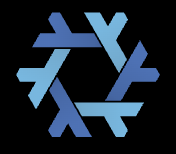

> Organizations which design systems are constrained to produce designs which are copies of the communication structures of those organizations.

-- Melvin Conway , 1967

# poag: **P**roduct **O**wner **A**gent **G**raph



`poag` looks for nix flakes and understands system design in terms of their inputs and outputs.
It creates a corresponding graph of AI product owners whose comunication graph is homomorphic to the flake graph.
Developers (or their agents) can use the various `poag` subcommands to communicate with the agent graph.

Each agent in the poag can:
- delegate to the appropriate specialist
- plan changes
- answer questions about...
  - how to use the software
  - the status of in progress or planned changes

Having more than one agent for these things is anticipated to be especially helpful when the project complexity exceeds what can fit in a single agent's context window.

## Adjacent Agents

Each agent in the poag thinks of its peers as either a producer or consumer of support:

| flake relationship | agent relationship |
| :--: | :-- |
| input | Their developers support us by changing the contents of this input |
| output | Our developer support them by changing the contents of this output | 

This greates a social graph which agents use to decide whether they should delegate a request, handle it themselves, or handle part of it and delegate other parts.

Humans can interact with any agent in the poag by running `poag` subcommands in the associated flake's devshell.
The corresponding agent will implement a scatter/gather approach where product owners contribute knowledge that matches their expertise, and know who to ask for knowledge that doesn't.

If you're uncertain, ask the root owner, it will find the appropriate owner for your query.
To be more targeted, instead act closer to the leaves of the dependency dag.


### Product Owners?

If a developer is working on changes that interact across multiple projects, their mind is likely to be full of fragments of context for those projects.
It's not clear how reusable this context is, since it's focused on their current journey and tomorrow's journey might be a different one.

Product Owners are permitted to stay focused on what that they own.
Their job is more compatible with fine-tuned expertise.

### An Example

Mostly, I anticipate using it to add context to prompts.
I'll send `poag` a prompt like:

> Make it ask "are you sure?" on logout and close any active sessions when this happens.

The various experts will chat about my request.
When they're in agreement about the plan, I'll get something like this:

```json
{
  "subflakes": {
    "foo-ui" : {
       "./some/test.js": "modify this to check if the question gets asked, currently just makes assertions about the button",
       "./some/component.js": "there is an on_exit event handler you can hook into here, be sure to not call exited() until after everything else is done"
     },
     "foo-server": {
       "./some/api.rs": "Add the on_exit api here",
       "./some/controller.rs": "session handling is in this file, you'll have to add some way to alter all sessions at once",
       "./tests/session_finish.rs": "there are no tests regarding session lifetime, but that should change, add one here"
     },
     "foo-event-listener": {
       "./event_parsing.py": "There's an enum in here that you'll have to update so that telemetry categorizes the new event appropriately"
     },
     "foo-uat": {
       "./tests": "There are several user acceptance tests in here, don't break them, and add one when you're done"
     }
  },
  "plan": [
    "Create a feature branch",
    "Run `nix flake check` in ./foo-ui, ./foo-server, and ./foo-uat just to be sure that you're starting with a clean bill of health",
    "Make the changes to foo-server, your new test should pass, add the changes in that flake to a commit",
    "Make the changes to foo-ui, your updated test should now pass, add the changes in that flake to a second commit",
    "Add the new user acceptance test and the new event enum in the event listener, ensure the test passes, also run `pyright` in the event listener flake, if it's clean, add both of these to a third commit",
    "Run ./generate_docs.sh in the root flake, create a commit with the updates that it makes (I hope you have good docstrings on your new code)",
    "Create a PR with these four commits and mark it merge-ready",
  ]
}
```
I can then feed this to my coding agent and supervise the work.

## Why?

For large projects, it's not practical to expect a single agent to have a complete picture of the code in their context window because then there's not enough headroom for actually doing the job.

### Many Partial Contexts, one Context Window

One approach is to instruct the agent to explore the project and come up with a plan.
In the example above they'd end up with partial knowledge of four subflakes.
Later, if I wanted another change made, It might still require partial knowledge of four subflakes, but it might need to be knowledge of different parts.

This is wasteful because each set of partial knowledges is specific to the prompt, so it's not worth re-using for the next prompt.
This puts us in a mode where all context is use-once-and-forget.

### Many Agents With "full" Context

In the above example, it might be somewhat costly to crate four experts and provide them with enough context to set the stage for gossip between them.
But, once they have mastery of their flake and they understand what they require of their neighbors (and what their neighbors require of them), we can make conversation checkpoints.
At that point, they can be consulted, rewound, and consulted again--one can rely on their expertise multiple times without repaying the cost of developing that expertise.

As the project changes, they'll still need to be updated about those changes, but by not forcing them to wear multiple hats, their context remains pure and they retain some of the magic that we see in demo's where LLM's code impressive things from scratch.
The developer agent, who consumes their directions, will not exhibit that magic, since it must span multiple contexts.
Unlike the product owners, its context will not be reused, but it's my hypothesis that it will benefit from the product owner recommendations and will need fewer tokens to get its job done.

At a certain point, the reduced needs of the developer (who doesn't recycle context) will outweigh the increased needs of the product owners (who do recycle context).

## Nix Subflakes

One half of this project is a copy of [hello-subflakes](https://github.com/MatrixManAtYrService/hello-subflakes):

- hello-py
- hello-rs
- hello-wasm
- hello web

It's a fancy hello world involving a Rust/Python FFI, compiling Rust to WASM, and then testing the rust-written functionality both via a browser and also via a python library.
It's not useful for anything, but it's a good playground for the other half of this project.

## `poag` CLI

There are a few more subflakes which are part of the poag project

- poag  (the CLI entrypoint)
  - poag-api (the openapi spec for `poag serve`)
  - poag-server (the poag server)
  - poag-client (the poag python client, used by the CLI)
  - poag-ui (the poag front end)

When it's mature, `poag` will be all alone in a repo, ready to be used as a flake input wherever it's needed.
Since it's experimental, it's currently packaged together with this subflake playground so that it has something to operate on.

