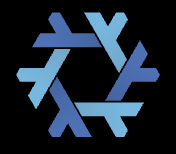

> Organizations which design systems are constrained to produce designs which are copies of the communication structures of those organizations.

-- Melvin Conway , 1967

# poag: **P**roduct **O**wner **A**gent **G**raph



`poag` looks for nix flakes and understands system design in terms of their inputs and outputs.
It creates a corresponding graph of AI product owners whose comunication graph is homomorphic to the flake graph.
Developers (or their agents) can use various `poag` subcommands to communicate with the agent graph.

Each agent in the poag can:
- delegate to the appropriate owner
- plan changes
- answer questions about...
  - how to use the software
  - the status of in progress or planned changes

Having more than one agent for these things is anticipated to be especially helpful when the project complexity exceeds what can fit in a single agent's context window.

## Adjacent Agents

Each agent in the poag thinks of its peers as either a producer or consumer of support:

| flake relationship | agent relationship |
| :--: | :-- |
| input | Their developers support us by changing the contents of this input |
| output | Our developer support them by changing the contents of this output | 

This greates a social graph which agents use to decide whether they should delegate a request, handle it themselves, or handle part of it and delegate other parts.

Humans can interact with any agent in the poag by running `poag` subcommands in the associated flake's devshell.
The corresponding agent will implement a scatter/gather approach where product owners contribute knowledge that matches their expertise, and know who to ask for knowledge that doesn't.

If you're uncertain, ask the root owner, it will find the appropriate owner for your query.
To be more targeted, instead act closer to the leaves of the dependency dag.


### Product Owners?

If a developer is working on changes that interact across multiple projects, their mind is likely to be full of fragments of context for those projects.
It's not clear how reusable this context is, since it's focused on their current journey and tomorrow's journey might be a different one.

Product Owners are permitted to stay focused on what that they own.
Their job is more compatible with fine-tuned expertise.

## Nix Subflake Playground

One half of this project is a copy of [hello-subflakes](https://github.com/MatrixManAtYrService/hello-subflakes):

- hello-py
- hello-rs
- hello-wasm
- hello web

It's a fancy hello world involving a Rust/Python FFI, compiling Rust to WASM, and then testing the rust-written functionality both via a browser and also via a python library.
It's not useful for anything, but it's a good playground for the other half of this project.

## Poag Subflakes

There are a few more subflakes which are part of the poag project

- poag  (the CLI entrypoint)
  - poag-api (the openapi spec for `poag serve`)
  - poag-server (the poag server)
  - poag-client (the poag python client, used by the CLI)
  - poag-ui (the poag front end)

When it's mature, `poag` will be in dedicate a repo, ready to be used as a flake input wherever it's needed.
Since it's experimental, it's currently packaged together with this subflake playground so that it has something to operate on.

## `poag` CLI

You can run `poag` commands in the root flake devshell, or at any of its children.
This allows you to engage with narrower or broader subsets of the poag.

### onboard

`poag onboard` will explain how to use poag.
This is not for the product owners themselves, but rather for the developer.

In addition to the commands indicated below it covers things like how to run a commands in a subflake:
```
nix develop ./path/to/subflake --unset PATH --command echo hello world
```
This ensures that whatever dependencies are used are indeed declared in that flake and not inherited from the calling environment.


### plan

The `plan` verb causes the poag to research what would be needed in order to make a change.
The agents will create issues [using beads](https://github.com/steveyegge/beads) to indicate the necessary work.
Once the necessary issues are created, a prompt will be written to stdout. 
This prompt can be handed off to a developer so they can use to start the work.

The idea is that since agents have focused context and are not asked to make changes, they can operate headlessly.
Developers, by contrast, may or may not need human supervision.

```
$ echo "autonomous aerial brand ambassadors to maximize paperclip demand" | poag plan
stderr > bd create "coherent extrapolated volition"? Y/n
stdin  > \n
stderr > bd create "hypnodrones"? Y/n
stdin  > \n
stderr > bd dep add issue-2 issue-1? Y/n
stdin  > \n
stdout > run `poag onboard`
stdout > then run `bd onboard` and follow the instructions
stdout > then run `bd show issue-a1b2` and begin work on that issue
```

### ask

<<<<<<< HEAD
```
$ echo "are the hypnodrones done yet?" | poag ask
```

### issues
=======
As a human user it might be nice to lean on the poag's expertise

```
$ echo "where is the power button on this hypnodrone?" | poag ask
stdout > it's on the top just besides the circular lidar array
```

Both `ask` and `plan` use the cwd to determine which owner to ask (the owners might then ask each other).
You can also specify a path to a flake as a way of starting the conversation with a different owner.

This may cut down on the gossip necessary to reach the right owner.
```
$ echo "where is the power button on this hypnodrone?" | poag ask ./tech/hardware
```

## `poag` server and session handling

Many poag commands will check `$XDG_STATE_HOME/poag/pid` and `$XDG_STATE_HOME/poag/port` to see if there's already a poag server running.
If so, they'll just create a new session and use the existing server (session ID: `{cwd}.{pid}.{counter}`, these are used for observability).

Generally speaking, owners in the poag are headless, and once you've selected an owner to communicate with, you get your responses from it (not from its subordinates or superiors, even if they were consulted by your selected owner as part of forming its response).
Run a command, get a response, done.

But if you want a more interactive experience, you can open a browser (run `poag view`).
You can aldo manage poag server state independently of the commands that need it:
- `poag serve`
- `poag status`
- `poag stop`


