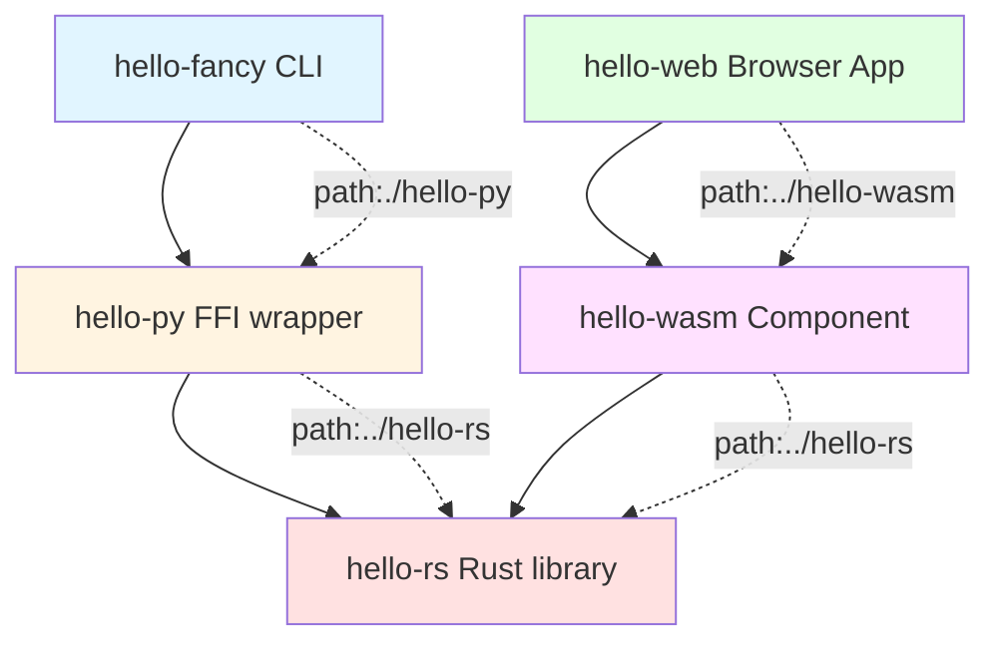

# Project Structure

This project demonstrates a multi-layer architecture using nested Nix flakes with relative path inputs. It showcases **two parallel consumer paths** for the same Rust library: a Python FFI wrapper with CLI, and a WebAssembly component for browsers.

## Architecture Overview

```
hello-fancy/                    # Root: Python CLI application
├── flake.nix                  # Depends on ./hello-py and ./hello-web
├── pyproject.toml             # Python project config with uv2nix
├── uv.lock                    # Python dependency lock file
├── src/hello_fancy/           # Python CLI source code
│   ├── __init__.py
│   └── cli.py                 # Typer CLI that uses hello_py
│
├── hello-rs/                  # Sibling: Pure Rust library (core)
│   ├── flake.nix             # Independent Rust flake
│   ├── Cargo.toml            # Rust library config
│   ├── Cargo.lock
│   └── src/lib.rs            # Simple hello(name: &str) -> String
│
├── hello-py/                  # Sibling: Python FFI wrapper
│   ├── flake.nix             # Depends on ../hello-rs via relative path input
│   ├── Cargo.toml            # Maturin project, path = "../hello-rs"
│   ├── Cargo.lock
│   ├── pyproject.toml        # Maturin Python bindings config
│   ├── src/
│   │   ├── lib.rs            # PyO3 FFI bindings to hello-rs
│   │   └── python/hello_py/
│   │       └── __init__.py   # Python module re-exporting _rust
│   └── tests/
│       └── test_hello.py     # Pytest tests
│
├── hello-wasm/                # Sibling: WebAssembly component wrapper
│   ├── flake.nix             # Depends on ../hello-rs via relative path input
│   ├── Cargo.toml            # wasm32-wasip2 target, path = "../hello-rs"
│   ├── Cargo.lock
│   ├── wit/
│   │   └── world.wit         # WIT interface: greeter with hello function
│   └── src/
│       └── lib.rs            # wit-bindgen bindings + formatted output
│
└── hello-web/                 # Sibling: Browser application
    ├── flake.nix             # Depends on ../hello-wasm via relative path input
    ├── package.json          # npm dependencies (jco, preview2-shim)
    ├── package-lock.json     # npm lock file
    └── src/
        └── index.html        # Browser UI: textbox, button, result display
```

## Design Philosophy

### Sibling Structure for Reusability
Components are organized as **siblings** rather than strict nesting. This allows multiple consumers (e.g., `hello-py`, future `hello-wasm`) to depend on `hello-rs` without duplication.

### Relative Path Inputs
Each flake uses Nix's relative path inputs feature (confirmed by the `parent` field in `flake.lock`):
- `hello-fancy/flake.nix`: `hello-py.url = "path:./hello-py"`
- `hello-py/flake.nix`: `hello-rs.url = "path:../hello-rs"`

This creates the dependency chain: **hello-fancy → hello-py → hello-rs**

### Flake.lock Verification
```json
{
  "hello-py": { "parent": [] },           // Relative to hello-fancy root
  "hello-rs": { "parent": ["hello-py"] }  // Relative to hello-py
}
```

## Component Details

### 1. hello-rs (Bottom Layer)

**Purpose**: Pure Rust library providing the core `hello` function.

**Location**: `hello-fancy/hello-rs/`

**Public API**:
```rust
pub fn hello(name: &str) -> String {
    format!("hello {}", name)
}
```

**Development Workflow**:
```bash
cd hello-fancy/hello-rs
nix develop

# Run tests
cargo test

# Build the library
cargo build --release

# Run doc tests
cargo test --doc
```

**Outputs**:
- `packages.default`: Rust library derivation
- `packages.hello-rs`: Same as default

**No dependencies**: This is a pure Rust library with no external dependencies.

---

### 2. hello-py (Middle Layer)

**Purpose**: Python library with PyO3 FFI bindings to `hello-rs`.

**Location**: `hello-fancy/hello-py/`

**Build Strategy**: Uses maturin to create a Python wheel containing:
- Rust code compiled to a native extension (`.so` file)
- Python wrapper that imports the extension

**Key Files**:
- `src/lib.rs`: PyO3 bindings that expose Rust functions to Python
- `src/python/hello_py/__init__.py`: Python module interface
- `Cargo.toml`: Rust dependencies including `path = "../hello-rs"`
- `pyproject.toml`: Maturin configuration with `bindings = "pyo3"`

**Development Workflow**:
```bash
cd hello-fancy/hello-py
nix develop

# Build with maturin (uv automatically creates .venv and installs deps)
uv run maturin develop

# Test the FFI bindings
uv run python -c "from hello_py import hello; print(hello('world'))"
# Output: hello world

# Run pytest tests (pytest installed via [dependency-groups])
uv run pytest -v

# Build wheel for distribution
uv run maturin build --release
```

**Note**: `uv run` automatically manages the virtual environment and installs dependencies from `[dependency-groups]`, so no manual venv/pip steps needed!

**Outputs**:
- `packages.default`: Python environment with test dependencies
- `packages.wheel`: Built maturin wheel (platform-specific .whl file)
- `packages.hello-rs`: Re-exported Rust library from subflake

**Dependencies**:
- Rust: `pyo3`, `hello-rs` (via relative path)
- Python: `pytest` (dev dependency)

---

### 3. hello-fancy (Top Layer)

**Purpose**: Python CLI application using typer that calls `hello_py`.

**Location**: `hello-fancy/` (root)

**CLI Behavior**:
```bash
$ hello-fancy claude
Hello Claude!
```

The CLI:
1. Calls `hello_py.hello("claude")` → returns "hello claude"
2. Capitalizes each word → "Hello Claude"
3. Adds exclamation mark → "Hello Claude!"

**Development Workflow**:
```bash
cd hello-fancy
nix develop

# The dev shell provides an editable Python environment with all dependencies
# hello_py is injected via Nix overlay from the ./hello-py subflake

# Run the CLI directly
python -m hello_fancy.cli claude
# Output: Hello Claude!

# Or use the installed command (from the Nix environment)
hello-fancy claude

# Test different inputs
hello-fancy rust
# Output: Hello Rust!

hello-fancy "hello world"
# Output: Hello Hello world!
```

**How hello_py is Provided**:
The top-level flake uses **overlay injection** (Approach 1 from your research) to provide `hello_py`:

```nix
helloPyOverlay = final: prev: {
  hello-py = (prev.hello-py or ...).overrideAttrs (old: {
    src = hello-py.packages.${system}.wheel;
    # ... install the wheel
  });
};
```

This means:
- `uv.lock` references `hello-py` as a path dependency
- At build time, Nix substitutes the actual wheel from the subflake
- No need to manually manage wheel files in vendor directories

**Building for Distribution**:
```bash
# Build the complete application
nix build

# Build just the Python package
nix build .#hello-fancy

# Run directly without installing
nix run . -- your-name

# Run with different arguments
nix run . -- alice
nix run . -- bob
```

**Outputs**:
- `packages.default`: Python virtual environment with hello-fancy
- `packages.hello-fancy`: The hello-fancy Python package
- `packages.hello-py-wheel`: Re-exported wheel from hello-py subflake
- `packages.hello-py-env`: Re-exported Python env from hello-py
- `packages.hello-rs`: Re-exported Rust library from hello-py's hello-rs
- `apps.default`: Runnable CLI application
- `apps.hello-fancy`: Same as default app

**Dependencies**:
- Python: `typer>=0.9.0`, `hello-py>=0.1.0` (via overlay)
- Nix: `hello-py` flake input, `uv2nix`, `pyproject-nix`

---

## Testing Strategy: Outer/Inner Test Architecture

This project uses a **two-layer testing strategy** where the root-level test suite runs and exposes results from each subflake's native tests. This approach provides several benefits:

### Benefits of the Outer/Inner Pattern

✅ **No intermediate build artifacts**: The outer tests invoke Nix flake checks, which are cached. No need to manage separate virtual environments or build directories.

✅ **Hermetic and reproducible**: Tests run in pure Nix sandboxes with no filesystem dependencies beyond what's in git.

✅ **Efficient caching**: Subflake tests are cached by Nix. If source hasn't changed, results are instant (often 60-80% faster on repeated runs).

✅ **Clear visibility**: Inner test results are displayed in the outer suite's output, making it easy to see which specific tests failed without diving into subflakes.

✅ **Constrained context**: When investigating failures, you can go directly to the relevant subflake where context is constrained and there are fewer distractions.

### The Testing Architecture

```
tests/                          # Root-level outer test suite
├── test_hello_rs.py           # Runs hello-rs cargo tests via Nix checks
├── test_hello_py.py           # Runs hello-py pytest via Nix checks
└── test_hello_wasm.py         # Runs hello-wasm wasmtime tests via Nix checks

hello-rs/
├── flake.nix                  # Defines checks.cargo-test
└── src/lib.rs                 # Contains #[test] functions (inner tests)

hello-py/
├── flake.nix                  # Defines checks.pytest
└── tests/test_hello.py        # Contains pytest tests (inner tests)

hello-wasm/
├── flake.nix                  # Defines checks.wasmtime-test
└── src/lib.rs                 # WebAssembly component (tested with wasmtime)
```

### Running the Complete Test Suite

**From the project root**, run all tests across all layers:

```bash
pytest tests/ -v -s
```

**Example output** showing inner test results:

```
tests/test_hello_rs.py::test_hello_rs_cargo_test_check
============================================================
Hello-rs cargo test results:
============================
Total: 1 tests
Passed: 1
Failed: 0
Ignored: 0
Duration: 0.68s

Tests run:
  [ok] tests::test_hello
  [hello] src/lib.rs
============================================================
PASSED

tests/test_hello_py.py::test_hello_py_pytest_check
============================================================
Hello-py pytest results:
=======================
Total: 2 tests
Passed: 2
Failed: 0
Skipped: 0
Duration: 0s

Tests run:
  [passed] tests/test_hello.py::test_hello_basic
  [passed] tests/test_hello.py::test_hello_empty_string
============================================================
PASSED

tests/test_hello_wasm.py::test_hello_wasm_wasmtime_check
============================================================
Hello-wasm wasmtime test results:
==================================
Total: 3 tests
Passed: 3
Failed: 0

Tests run:
  [passed] test_hello_basic
  [passed] test_hello_name
  [passed] test_hello_multiword
============================================================
PASSED

============================== 6 passed in 19.34s ==============================
```

### How Each Subflake Implements Tests

#### hello-rs: Cargo Tests

The `hello-rs` flake defines a `checks.cargo-test` derivation that:
1. Runs `cargo test` in a pure sandbox
2. Parses output to extract test counts and individual test results
3. Creates a `summary.txt` file with formatted results
4. Fails the derivation if any tests fail

The outer test (`tests/test_hello_rs.py`) invokes this check via:
```bash
nix build ./hello-rs#checks.aarch64-darwin.cargo-test
```

#### hello-py: Pytest Tests

The `hello-py` flake defines a `checks.pytest` derivation that:
1. Builds the maturin wheel in isolation
2. Runs pytest in a virtual environment
3. Parses pytest's JSON output for test results
4. Creates a `summary.txt` file

The outer test (`tests/test_hello_py.py`) invokes this check and displays the summary.

#### hello-wasm: Wasmtime Tests

The `hello-wasm` flake defines a `checks.wasmtime-test` derivation that:
1. Builds the WebAssembly component
2. Sets up a hermetic environment (`HOME=$TMPDIR`, `XDG_*` directories)
3. Runs `wasmtime run -C cache=n --invoke ...` to test component functions
4. Captures test results and creates a `summary.txt`

The `-C cache=n` flag disables wasmtime's cache, ensuring tests don't depend on local filesystem state beyond the Nix store.

### Development Workflow: Inner Tests First

When developing, you typically work within a subflake and run its native tests:

**Editing Rust (`hello-rs`)**:
```bash
cd hello-rs
nix develop
# Edit src/lib.rs
cargo test
# ✓ Fast feedback loop with native cargo test
```

**Editing Python FFI (`hello-py`)**:
```bash
cd hello-py
nix develop
# Edit src/lib.rs or src/python/hello_py/
uv run maturin develop
uv run pytest -v
# ✓ Fast feedback with native pytest
```

**Editing WebAssembly (`hello-wasm`)**:
```bash
cd hello-wasm
nix develop
# Edit src/lib.rs
cargo build --target wasm32-wasip2
wasmtime run -C cache=n --invoke 'hello("test")' target/wasm32-wasip2/debug/hello_wasm.wasm
# ✓ Manual testing during development
```

Then, before committing, run the outer test suite from the root to verify everything works together:

```bash
cd ..  # Back to project root
pytest tests/ -v -s
```

### Caching and Performance

The Nix-based approach provides excellent caching:

**First run** (cold cache):
```bash
pytest tests/test_hello_wasm.py -v -s
# ============================== 2 passed in 1.26s ==============================
```

**Second run** (warm cache):
```bash
pytest tests/test_hello_wasm.py -v -s
# ============================== 2 passed in 0.51s ==============================
```

Nix detects that source files haven't changed and reuses the cached test results, leading to ~60% speedup on subsequent runs.

## Dependency Graph



**Legend**:
- Solid arrows: Code dependency
- Dotted arrows: Nix flake input (relative path)
- **hello-rs** (red): Core Rust library
- **hello-py** (yellow): Python FFI bindings
- **hello-wasm** (purple): WebAssembly Component
- **hello-fancy** (blue): Python CLI application
- **hello-web** (green): Browser application

## Key Technologies

- **Nix Flakes**: Reproducible builds and development environments
- **uv2nix**: Python dependency management with uv and Nix
- **PyO3**: Rust ↔ Python FFI bindings
- **Maturin**: Build tool for Rust-based Python packages
- **Typer**: Python CLI framework
- **Pytest**: Python testing framework
- **WebAssembly Component Model**: WASI 0.2 components with WIT interfaces
- **wasmtime**: WebAssembly runtime for testing and executing components
- **wit-bindgen**: Generate Rust bindings from WIT interface definitions

## Adding New Consumers

To add `hello-wasm` (or any other consumer of `hello-rs`):

```bash
cd hello-fancy
mkdir hello-wasm
cd hello-wasm

# Create flake.nix with:
# inputs.hello-rs.url = "path:../hello-rs";

# Create Cargo.toml with:
# [dependencies]
# hello-rs = { path = "../hello-rs" }
```

The sibling structure ensures `hello-rs` isn't duplicated!

## Troubleshooting

### "Cannot find hello-rs"
Ensure you've run `git add -A` before building - Nix flakes only include tracked files.

### "Flake input not found"
Check that relative paths in `flake.nix` match the actual directory structure.

### "Module 'hello_py' not found"
In `hello-py`, make sure you've run `maturin develop` after entering the dev shell and activating the venv.

### "Parent field missing in flake.lock"
Your Nix version may not support relative path inputs. The PR was merged in late 2024.

## References

- Nix Relative Path Inputs PR: https://github.com/NixOS/nix/pull/11034
- PyO3 Documentation: https://pyo3.rs/
- Maturin Guide: https://www.maturin.rs/
- uv2nix: https://github.com/pyproject-nix/uv2nix
